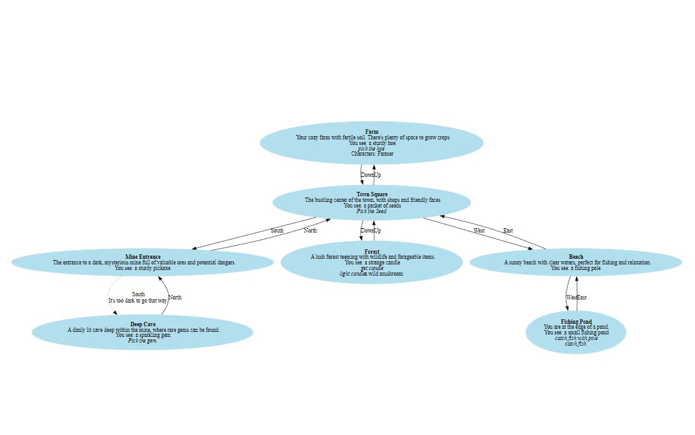

# Text-Adventure-Game
## About

***A simple text adventure game based on the stardew valley game***
### Location

1. Farm
2. Town Square
3. Mine Entrance
4. Fishing Pond
5. Deep Cave
6. Beach
7. Forest

Items:

1. Hoe
2. Seeds
3. Pickaxe
4. Fishing Pole
5. Gem
6. Pond (non-gettable)
7. Mushroom
8. Candle
9. Lantern

### Character:

***Farmer (Player)***

The player starts the game at the farm with a lantern which is left to you by your grandfather. The goal is to explore the world, gather items, and complete tasks to win the game.

### Key gameplay elements include:

1. Planting seeds at the farm using the hoe and seeds.
2. Mining for gems in the cave using the pickaxe.
3. Fishing at the fishing pond using the fishing pole.
4. Exploring the forest to find mushrooms and a candle.
5. Using the lantern to navigate dark areas like the cave.

The game includes a custom "Plant" action that allows the player to plant seeds at the farm if they have the necessary items (hoe and seeds).

There's also a "Darkness" block implemented for the cave, which prevents entry unless the player has a lit lantern.
The win condition is achieved when the player has planted seeds, obtained the gem, and has the pickaxe in their inventory.
The game ends if the player picks up the mushroom, adding an element of danger to exploration.

### Motivation to choose this game

I created this game, as I have been playing this game for last one year and its so good and calm to play. So that's why I chose StarDew Valley as the base game whose directed graph is below:

